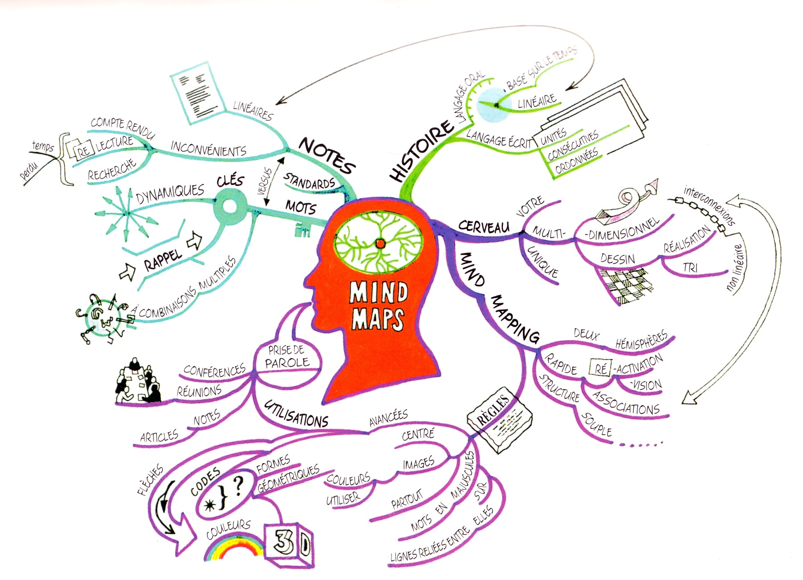

Le **Mindmap** est une méthode pour visualiser l'information popularisée dans les années 1970 par Tony Buzan (1942-2019), dans une série documentaire sur le fonctionnement du cerveau. Buzan a écrit de nombreux livres au sujet de l'apprentissage, de la mémoire et du cerveau.

Le terme Mindmap peut être traduit par "carte mentale" ou "carte heuristique". C'est un diagramme qui représente les connexions sémantiques entre différentes idées et les liens hiérarchiques entre différents concepts intellectuels.

Selon Buzan,  c'est un moyen très efficace, autant pour "enregistrer" une information (la prise de notes), que pour produire des idées. Le mindmap reflète la nature du cerveau humain à établir des liens entre des concepts-clés. Il est plus proche du fonctionnement organique qu'un texte linéaire. Il permet d'établir de nouvelles associations.

Dans son livre "Une tête bien faite" (1974), Buzan propose 7 "règles du mindmapping":

1. Une image centrale (en couleurs).
2. Utiliser des images.
3. Ecrire en MAJUSCULES.
4. Ecrire sur des lignes.
5. Un seul mot par ligne.
6. Utiliser des couleurs.
7. Garder l'esprit LIBRE!

## Utilisations du Mindmap

- Elaborer la structure d'un travail écrit.
- Structurer ses connaissances avant un examen.
- Prendre des notes, pendant un cours, une conférence.
- Prendre des notes durant une réunion.

