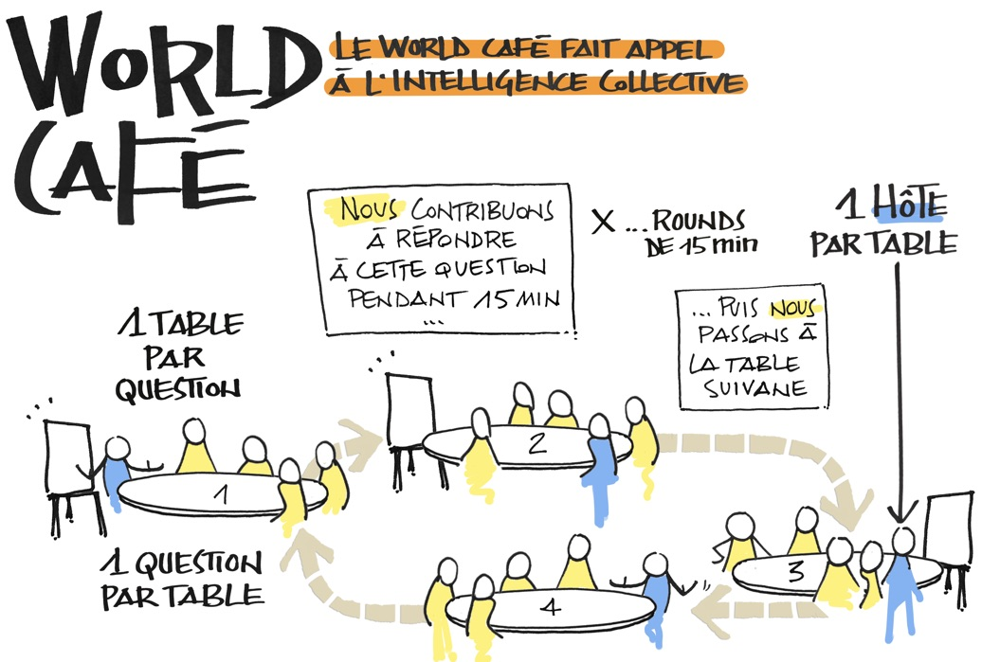
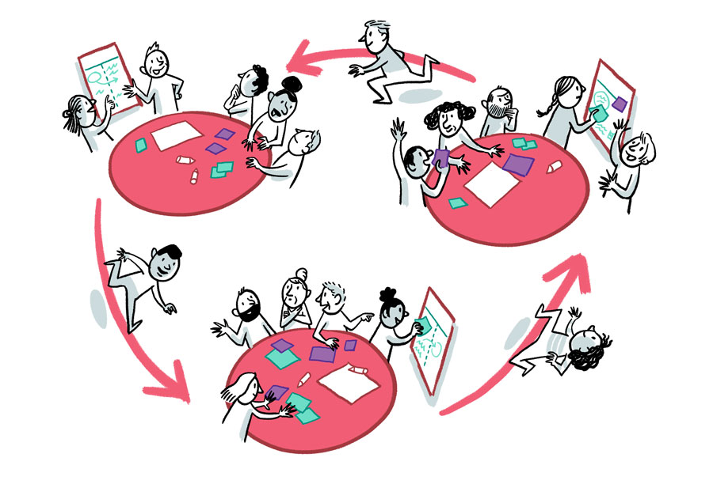

Le World Café est une technique phare de l'intelligence collective. Ce format de réunion a été défini par Juanita Brown et David Isaacs en 1995, lors d'une réunion avec 24 participant·es. La méthode a été développée ensuite dans le cadre du *Institute for Social Innovation* à l'Université de Fielding.

Le World Café permet à un grand groupe de participants (généralement entre vingt et cent personnes) de brainstormer, par table, sur des thématiques imaginées en amont, et de compléter de manière itérative les productions avec le regard neuf des participants qui passent de table en table.

Dans le livre *"Passez en mode workshop agile"* (Moutot, Autissier, Duperret 2018), le World Café est présenté comme un format permettant de structurer un workshop. C'est cette version qui est présentée ci-dessous.

## Comment ça fonctionne ?

Des tables thématiques ont été dressées avec la possibilité d'écrire sur les nappes, et/ou sur des paperboards. L'animateur·trice de chaque table est fixe, il ou elle anime les discussions à sa table tout au long du processus.

**Chaque table** fait l'objet d'une **thématique**, généralement problématisée sous forme de **question**.

Les participant·es vont tourner de table en table à fréquence régulière, en **trois ou quatre «rounds»** en tout. À chaque rotation, le temps passé au sein de la nouvelle table diminue (exemple: premier round: 45 min, deuxième round: 30 min, 20, 15, etc). Les participant·es ont ainsi la possibilité de prendre connaissance de ce que les groupes précédents ont proposé, puis de compléter et enrichir les productions.

- **Au premier tour** : Les participant·es se répartissent par table (sur la base du volontariat ou d'un plan de table). Chaque animateur·trice note au fur et à mesure les idées émises au paperboard ou sur la nappe en papier. Le premier round dure généralement entre 30 et 45 minutes.
- **Aux tours suivants** : Les participant·es changent de table. En général, on demande à chaque groupe de tourner d'un cran. L'animateur·trice de chaque table prend quelques minutes pour faire état des réflexions issues du premier round. Puis les participant·es complètent, enrichissent, demandent des clarifications, peuvent challenger de manière constructive les propositions déjà émises dans le but de les rendre plus robustes. Par la rapidité imposée via ce rythme qui s'accélère à chaque round, les participant·es entrent dans un mode de réflexion / production efficace et concis.

### Exemple de structure

| Étape   | Timing  | Quoi?    |
|:------- |:------- |:----------------- |
| 1) | 15 min | Le facilitateur·trice introduit l'atelier et présente les thématiques et les animateurs·trices de chaque table. Chaque animateur·trice de table peut dire un mot de son thème et des attendus. |
| 2) | 45 min (1h) | **Premier round** : les participant·es se répartissent par table. Chaque animateur·trice note les idées émises. |
| 3) | 30 min (1h30) | **Deuxième round** : les participant·es changent de table. L'animateur·trice de chaque table résume les réflexions issues du premier round. Puis les participants·es complètent, enrichissent. |
| 4) | 20 min (1h50) | Le **troisième round** démarre pour 20 minutes, éventuellement un **quatrième** pour 15 minutes. |
| 5) | 15‑30&nbsp;min (2h20) | Chaque animateur·trice restitue le fruit des travaux de sa table. |
| 6) | 5 min (2h25) | Le facilitateur·trice annonce les prochaines étapes et conclut le World Café. |

**Durée totale:**  
2h25 avec trois rounds.  
2h40 avec quatre rounds.

## Pourquoi choisir cet atelier ?

Le World Café stimule l'intelligence collective par un processus d'ouverture basé sur la fertilisation croisée (les groupes enrichissent et complètent les productions), et de recentrage efficace (diminution du temps passé sur chaque table nouvelle). Il est particulièrement utilisé quand il est nécessaire de mobiliser des groupes importants et de produire dans un temps limité un plan d'action, une feuille de route.

## Conseils

- Bien choisir les animateurs·trices de chaque table et les briefer aux consignes d'animation.
- Surveiller que l'ensemble des participant·es s'expriment, aller chercher les personnes muettes et recadrer gentiment les personnes trop bavardes.
- Utiliser un espace suffisamment grand pour que le bruit ne soit pas un problème car les échanges sont généralement vifs et animés.

## Liens et ressources

- [Fiche World Café](https://www.atelier-collaboratif.com/58-world-cafe.html) sur L'atelier collaboratif
- Retour d'expérience: [Mener une rétrospective multi-équipes : le World Café](https://jp-lambert.me/mener-une-r%C3%A9trospective-multi-%C3%A9quipes-le-world-caf%C3%A9-f7f7914a8655)
- [World-Café](https://de.wikipedia.org/wiki/World-Caf%C3%A9), article wikipédia en allemand
- Méthode proche: Knowledge café ou "[Café du savoir](https://fr.wikipedia.org/wiki/Caf%C3%A9_du_savoir)" (article Wikipédia)

## Explication en vidéo

Vidéo explicative, par EC4CI (European Centre for Collective Intelligence):

<iframe width="100%" height="315" src="https://www.youtube.com/embed/KxRw34MvH5U" title="YouTube video player" frameborder="0" allow="accelerometer; autoplay; clipboard-write; encrypted-media; gyroscope; picture-in-picture" allowfullscreen></iframe>

