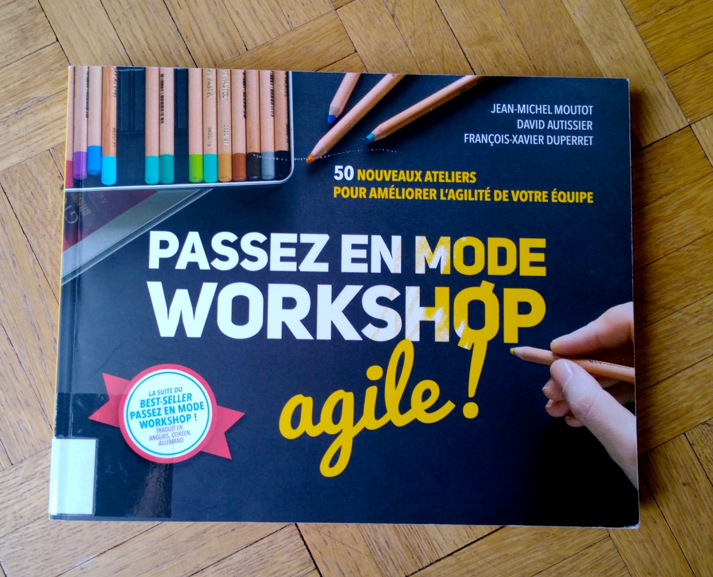

### Livres autour de la créativité

- Guillaume Lamarre. *La Voie du créatif*. Pyramyd.
- *L'art du storytelling*, Guillaume Lamarre, Pyramyd.
- Dorte Nielsen, Sarah Thurber. *Les secrets de la pensée créative*. Pyramyd.
- Jake Knapp (2019). *Sprint : Résoudre les problèmes et trouver de nouvelles idées en cinq jours*. Eyrolles. (658 KNA)
- Jean-Michel Moutot, David Autissier, François-Xavier Duperret (2018). *Passez en mode workshop agile ! : 50 nouveaux ateliers pour améliorer l'agilité de votre équipe*. Pearson France. (658 MOU)

### Livres édités par Ellen Lupton

- Ellen Lupton (2011). *Graphic Design Thinking*, Princeton Architectural Press (765 GRA)
- *Design is Storytelling*, Thames & Hudson

### Livres contenant des briefs créatifs

- Jason Fulford (2014), *The Photographer’s Playbook: 307 Assignments and Ideas*. Aperture. (77 PHO). - Un livre-ressource qui propose 307 briefs et idées pour l'enseignement de la photo.
- *Les secrets de la pensée créative* (Dorte Nielsen, Sarah Thurber) comporte un programme de 21 exercices créatifs.

### Sur les ateliers de créativité / brainstorming

- *Passez en mode workshop agile ! : 50 nouveaux ateliers pour améliorer l'agilité de votre équipe*. Jean-Michel Moutot ; David Autissier ; François-Xavier Duperret. Montreuil : Pearson France, (2018). (658 MOU)

